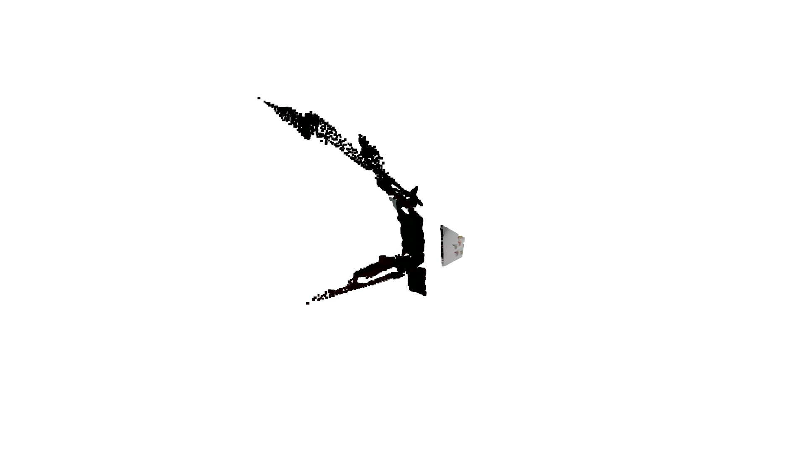

# POPIS SLIKA
- Slika 1: Prikaz rezultata segmentacije i procjene 3D centroida na točkastom oblaku.

# POPIS TABLICA
- Tablica 1: Usporedba procjene 3D centroida između AABB i sfernog modela.

# UVOD
U sklopu ovog seminarskog zadatka, cilj je bio razviti i implementirati sustav računalnog vida sposoban detektirati specifične vrste voća u kompleksnim i zagušenim scenama (npr. kutija ili zdjela s preklapajućim plodovima). Zadatak se sastojao od dvije glavne komponente: primjene dubokog učenja za segmentaciju instanci (*instance segmentation*) u 2D prostoru te korištenja dobivenih maski za procjenu 3D pozicije (centroida) detektiranih plodova u oblaku točaka (*point cloud*). 

Kroz rad su korištene tehnike mapiranja 2D piksela u 3D prostor (RGB-D poravnanje), ekstrakcije točkastih oblaka pojedinih instanci te napredne metode procjene centra mase. U ovom izvješću bit će opisan cjelokupni proces od pripreme i anotacije podataka do treniranja modela i završne evaluacije.

# PRIPREMA SKUPA PODATAKA
Sukladno uputama, odabrane su različite klase voća koje su izrađene tehnologijom 3D ispisa (crvena jabuka, zelena jabuka, limun, banana, avokado, orah i kruška). Studenti su međusobno podijelili klase te je svatko bio zadužen za pripremu i anotaciju vlastitih slika. Osobno sam preuzeo rad i evaluaciju nad klasom **"crvena jabuka"**.

## Anotacija slika
Kako bi model uspješno razlikovao objekte od pozadine i rješavao problem preklapajućih plodova, izvršena je precizna anotacija slika tehnikom segmentacije instanci. Kao alat za anotaciju korišten je sustav **Roboflow**. 

Prije početka procesa stvorena je zajednička `.csv` datoteka sa strogo usuglašenim nazivima klasa. Svaki student je nezavisno anotirao vlastiti trening skup na originalnim slikama bez primjene augmentacija.

## Spajanje i augmentacija
Nakon završetka pojedinačnih anotacija, svi skupovi podataka su spojeni u jedan jedinstven i cjelovit *dataset*. Ovaj objedinjeni skup ponovno je učitan na Roboflow platformu, gdje su primijenjene tehnike augmentacije slike. Cilj augmentacija bio je umjetno povećati raznolikost podataka u trening skupu i posljedično povećati robusnost modela. Konačan skup podataka eksportiran je iz sustava i pripremljen za proces učenja.

# TRENIRANJE MODELA
Za rješavanje zadatka segmentacije instanci primijenjena je arhitektura konvolucijske neuronske mreže **YOLOv26nano**. 

Trening modela izvršen je na prethodno spojenom i augmentiranom skupu podataka koji obuhvaća sve navedene klase voća. Proces učenja odvijao se kroz zadani broj epoha, nakon čega je uslijedila detaljna analiza dobivenih rezultata. Zabilježena je visoka točnost prepoznavanja oblika, a naučene težine modela sačuvane su za potrebe daljnje evaluacije i integracije u 3D sustav obrade.

# EVALUACIJA I PROCJENA POZE (3D)
Nakon uspješnog treninga na cjelokupnom setu podataka, evaluacija modela i implementacija cjevovoda (*pipeline*) za procjenu poze izvršena je isključivo na izdvojenom skupu podataka za zadanu klasu "crvena jabuka".

## RGB-D mapiranje i ekstrakcija
Korištenjem treniranog YOLOv26nano 2D modela za segmentaciju instanci, uspješno su detektirana područja (maske) crvenih jabuka na RGB slikama unutar vrlo zagušene scene. Sukladno zadatku, detektirane 2D maske mapirane su na odgovarajuće 3D točke pomoću RGB-D poravnanja (*RGB-D alignment*). 

Za svaku detektiranu instancu izvučen je pripadajući oblak točaka (*point cloud*), čime je dobiven precizan 3D prikaz vidljivog dijela voća na temelju kojeg je bilo moguće odrediti prostornu pozu.

## Procjena 3D centroida
Kako bi se procijenila točna pozicija svakog ploda u prostoru, implementirane su i uspoređene dvije metode određivanja 3D centroida na izdvojenom oblaku točaka svake instance:
1. **Ekstrakcija 3D okvira (AABB - Axis-Aligned Bounding Box)**: Određivanje geometrijskog središta 3D okvira ograničenja (orijentiranog prema osima) koji u potpunosti obuhvaća točkasti oblak instance.
2. **Geometrijsko prepoznavanje modela (Sphere fitting)**: Aproksimacija sfere (kugle) nad izoliranim točkama primjenom algoritma za prilagodbu matematičkog modela, nakon čega se centar dobivene sfere uzima kao stvarni centroid ploda. Ova metoda se pokazala intuitivnom za odabranu klasu zbog njezinog prirodnog, kuglastog oblika.

*Slika 1: Prikaz rezultata segmentacije i procjene 3D centroida na točkastom oblaku.*

## Usporedba rezultata
Vizualizacijom i međusobnom usporedbom dviju metoda primijećeno je da aproksimacija sfere daje znatno realističnije pozicije centra mase. Kod slučajeva kada je jabuka djelomično zaklonjena (zbog preklapanja s drugim voćem u zdjeli), metoda AABB često pomiče centroid prema rubu preostalog vidljivog oblika. Nasuprot tome, prilagodba sferi uspješno kompenzira nedostatak točaka i ispravno projicira centar unutar samog volumena voća.

| Scena (Crvena jabuka) | Centroid AABB (x, y, z) [m] | Centroid Sfera (x, y, z) [m] | Udaljenost centara [m] |
|-----------------------|-----------------------------|------------------------------|------------------------|
| Scena 0001 | [0.007, -0.031, 0.261] | [0.003, -0.027, 0.250] | 0.0113 |
| Scena 0002 | [0.020, 0.007, 0.237] | [-0.027, -0.018, 0.229] | 0.0554 |
| Scena 0003 | [-0.040, -0.109, 0.373] | [-0.049, -0.098, 0.362] | 0.0185 |

*Tablica 1: Usporedba procjene 3D centroida između AABB i sfernog modela za odabrane instance.*

# ZAKLJUČAK
Realizirani projekt uspješno demonstrira cjelokupni postupak i sinergiju modernih metoda dubokog učenja i obrade 3D točkastih oblaka. Trenirani YOLOv26nano model postigao je visoku preciznost u segmentaciji instanci crvene jabuke i ostalog voća unatoč izazovnim scenama s preklapanjem. 

Implementirani cjevovod za RGB-D mapiranje omogućio je izolaciju 3D oblaka točaka za svaku pojedinu instancu. Analiza procjene 3D centroida jasno je pokazala da metoda geometrijskog prepoznavanja modela (sferna aproksimacija) nadmašuje klasičnu metodu 3D okvira ograničenja (AABB), posebice u situacijama kada je plod samo djelomično vidljiv kameri. Izrađeni sustav pruža robusnu i pouzdanu ulaznu pretpostavku 3D poze koja se može direktno iskoristiti za interakciju s okolinom, poput navigacije i primjene hvataljki na humanoidnim ili industrijskim robotima.
