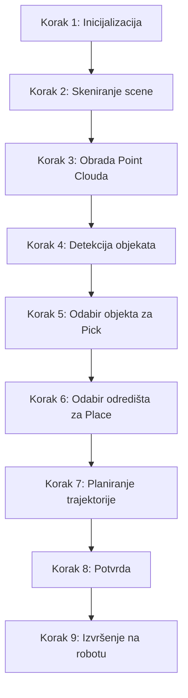

# Upute za Korištenje — Pick-and-Place CLI Aplikacija

Ovaj dokument sadrži detaljne upute za postavljanje, konfiguraciju i pokretanje centralne interaktivne **Pick-and-Place CLI aplikacije** za UR3e robot i Intel RealSense RGB-D kameru. Aplikacija objedinjuje percepciju (snimanje i obradu point clouda), detekciju objekata (YOLO i segmentacija po boji), planiranje trajektorija (kvintička interpolacija i SLERP) i kontrolu robota (slanje URScript naredbi preko socketa).

---

## 📋 Sadržaj
1. [Preduvjeti i Instalacija](#1-preduvjeti-i-instalacija)
2. [Konfiguracija aplikacije (`src/config.py`)](#2-konfiguracija-aplikacije-srcconfigpy)
3. [Pokretanje aplikacije](#3-pokretanje-aplikacije)
   - [Offline / Sintetički mod (Bez opreme)](#offline--sintetički-mod-bez-opreme)
   - [Online mod (S UR3e robotom i RealSense kamerom)](#online-mod-s-ur3e-robotom-i-realsense-kamerom)
4. [Vodič kroz korake aplikacije (CLI Workflow)](#4-vodič-kroz-korake-aplikacije-cli-workflow)
5. [Struktura projekta](#5-struktura-projekta)
6. [Otklanjanje poteškoća (Troubleshooting)](#6-otklanjanje-poteškoća-troubleshooting)

---

## 1. Preduvjeti i Instalacija

Aplikacija je razvijena za rad na **Windows** operacijskom sustavu i koristi Python virtualno okruženje (`.venv`).

### Koraci za postavljanje:

1. **Kloniranje / Pristup repozitoriju** i pozicioniranje u korijenski direktorij projekta:
   ```powershell
   cd d:\truenas_kresimir_share_cp\FSB\semestar_10\humanoidna\zadaca_03
   ```

2. **Aktivacija virtualnog okruženja**:
   ```powershell
   .\.venv\Scripts\Activate.ps1
   ```

3. **Instalacija ovisnosti** (ako već nisu instalirane):
   ```powershell
   pip install -r requirements.txt
   ```
   *Napomena: Glavne biblioteke uključuju `open3d`, `scipy`, `matplotlib`, `ultralytics` (YOLO), `opencv-python` i `pyrealsense2`.*

---

## 2. Konfiguracija aplikacije (`src/config.py`)

Svi parametri sustava nalaze se u datoteci [config.py](file:///d:/truenas_kresimir_share_cp/FSB/semestar_10/humanoidna/zadaca_03/src/config.py). Prije pokretanja na stvarnoj opremi, prilagodite sljedeće parametre:

*   **Mrežne postavke robota**:
    ```python
    ROBOT_IP = "192.168.208.128"  # IP adresa UR3e robota ili URSim simulatora
    ROBOT_PORT = 30003            # Real-Time interface port
    ```
*   **Postavke grippera**:
    ```python
    GRIPPER_PIN = 0               # Digitalni izlaz (DO) za kontrolu grippera
    GRIPPER_WAIT = 0.5            # Čekanje (u sekundama) nakon otvaranja/zatvaranja
    ```
*   **Predefinirana odlagališta (Baskets)**:
    ```python
    PLACE_LOCATIONS = {
        "Košara A": {
            "position": np.array([-0.30, 0.20, 0.35]),
            "orientation": np.array([np.pi, 0.0, 0.0]),
        },
        "Košara B": {
            "position": np.array([-0.30, -0.20, 0.35]),
            "orientation": np.array([np.pi, 0.0, 0.0]),
        },
    }
    ```
*   **Parametri Point Cloud obrade**:
    Uključuju `PCL_VOXEL_SIZE` (veličina voxela), `PCL_PASSTHROUGH` (granice rezanja po Z-osi), i `PCL_RANSAC_DISTANCE` (threshold za uklanjanje stola).

---

## 3. Pokretanje aplikacije

Aplikacija se pokreće preko glavne skripte [main.py](file:///d:/truenas_kresimir_share_cp/FSB/semestar_10/humanoidna/zadaca_03/src/main.py).

### Offline / Sintetički mod (Bez opreme)
Koristite ovaj mod za testiranje logike obrade, detekcije, planiranja trajektorija i vizualizacija na računalu bez spojenog robota i kamere.
```powershell
python src/main.py --offline
```
*U ovom modu, aplikacija automatski generira trodimenzionalnu sintetičku scenu (stol, jabuka, banana, kutija) te simulira izvršenje i ispisuje URScript naredbe na ekranu.*

### Online mod (S UR3e robotom i RealSense kamerom)
Pokrenite bez argumenata kada su stvarni robot (ili URSim) i RealSense kamera spojeni na istoj mreži / računalu.
```powershell
python src/main.py
```
*Ako spajanje na fizičke uređaje ne uspije, aplikacija će vam ponuditi automatski prijelaz na simulirane/sintetičke module.*

---

## 4. Vodič kroz korake aplikacije (CLI Workflow)

Aplikacija vodi korisnika kroz **9 strukturiranih koraka**:



### Detaljan opis koraka:

### ⚙️ Korak 1: Inicijalizacija
*   Učitavaju se kalibracijske matrice iz `data/processed/calibration/` (ako ne postoje, koristi se identitet).
*   Uspostavlja se TCP/IP veza s robotom (port 30003) i pokreće se RealSense pipeline.

### 📸 Korak 2: Skeniranje scene
*   Korisnik odabire broj pozicija za snimanje (1-3).
*   Kamera snima RGB i dubinsku (Depth) sliku te ih pretvara u point cloud.
*   Rezultirajući point cloud se sprema u `data/raw/` i prikazuje se u interaktivnom Open3D prozoru.
    > [!NOTE]
    > **Važno:** Svaki Open3D prozor za vizualizaciju potrebno je **zatvoriti** (pritiskom na tipku `Q` ili klikom na `X`) kako bi CLI proces nastavio s izvođenjem.

### 🧹 Korak 3: Obrada Point Clouda
*   Point cloud prolazi kroz filtraciju: PassThrough filter (izrezivanje ROI po Z-osi) i SOR (Statistical Outlier Removal za uklanjanje šuma).
*   Radi se downsampling preko VoxelGrida (rezolucija 5 mm).
*   Kod snimanja iz više pozicija, vrši se pairwise registracija (RANSAC + ICP) i fuzija u jedan zajednički oblak točaka.

### 🔍 Korak 4: Detekcija objekata
*   RANSAC segmentacija pronalazi i uklanja najveću ravninu (stol) kako bi ostali samo objekti.
*   Euclidean Clustering razdvaja preostale točke u zasebne 3D klastere.
*   YOLO model vrši 2D detekciju na RGB slici, a rezultati se projektivnom geometrijom mapiraju na 3D klastere.
*   Ako YOLO model nije dostupan, koristi se fallback metoda koja prepoznaje klastere i dodjeljuje im generička imena.

### 🍎 Korak 5: Odabir objekta za Pick
*   CLI ispisuje tablicu svih detektiranih objekata s njihovim klasama, pouzdanostima (confidence) i 3D centroidima u koordinatnom sustavu baze robota.
*   Korisnik upisuje ID objekta koji želi podići.
*   Aplikacija otvara Open3D prozor u kojem je odabrani objekt obojan u crveno, s prikazanim bounding boxom i plavom sferom centroida.

### 📥 Korak 6: Odabir odredišta za Place
*   Korisnik bira predefinirano odlagalište (npr. *Košara A*, *Košara B*) ili odabire ručni unos koordinata `[X, Y, Z]` u metrima u odnosu na bazu robota.

### 📈 Korak 7: Planiranje trajektorije
*   Izračunava se 5 ključnih referentnih točaka u prostoru:
    1.  `HOME` (zglobne koordinate)
    2.  `APPROACH` (100 mm iznad objekta)
    3.  `PICK` (hvatanje objekta)
    4.  `APPROACH_PLACE` (100 mm iznad koša)
    5.  `PLACE` (odlaganje objekta)
*   Između točaka se planiraju glatke trajektorije (kvintička interpolacija i SLERP rotacija).
*   Provjeravaju se brzinska i akceleracijska ograničenja robota.
*   Vizualiziraju se 3D putanja (Open3D) i profili pozicije, brzine i ubrzanja (Matplotlib grafovi).

### ⚠️ Korak 8: Potvrda
*   CLI prikazuje sigurnosno upozorenje i traži od korisnika eksplicitnu potvrdu (`d/n`) prije slanja pokreta robotu.

### 🦾 Korak 9: Izvršenje na robotu
*   Trajektorija se sprema u [last_trajectory.json](file:///d:/truenas_kresimir_share_cp/FSB/semestar_10/humanoidna/zadaca_03/data/processed/last_trajectory.json).
*   Aplikacija generira URScript naredbe i šalje ih preko socketa na robot, upravljajući digitalnim izlazom (DO) za otvaranje i zatvaranje grippera u pravim trenucima.
*   Nakon odlaganja objekta, robot se vraća u sigurnu `HOME` poziciju.

---

## 5. Struktura projekta

Evo pregleda ključnih datoteka unutar repozitorija:

*   📂 `src/` — Izvorni kod aplikacije
    *   📄 [main.py](file:///d:/truenas_kresimir_share_cp/FSB/semestar_10/humanoidna/zadaca_03/src/main.py) — Glavni interaktivni CLI program.
    *   📄 [config.py](file:///d:/truenas_kresimir_share_cp/FSB/semestar_10/humanoidna/zadaca_03/src/config.py) — Konfiguracijske postavke.
    *   📂 `01_percepcija/` — Povezivanje kamere i obrada oblaka točaka.
    *   📂 `02_detekcija/` — Prepoznavanje objekata i 3D lokalizacija.
    *   📂 `03_planiranje/` — Generiranje glatkih trajektorija i URScripta.
    *   📂 `04_izvrsenje/` — Kontrola UR3e robota i grippera preko socketa.
    *   📂 `utils/` — Pomoćni moduli za transformacije i vizualizaciju.
*   📂 `data/` — Pohrana podataka
    *   📂 `models/` — YOLO težinski faktori (`.pt`).
    *   📂 `raw/` — Snimljeni point cloudovi (`.pcd`).
    *   📂 `processed/` — Rezultati obrade i zadnja planirana trajektorija.
*   📂 `docs/` — Dokumentacija, slike i LaTeX izvješće zadaće.

---

## 6. Otklanjanje poteškoća (Troubleshooting)

### 🔴 Problem: Kamera nije pronađena / `pyrealsense2` se ne učitava
*   **Rješenje**: Provjerite je li RealSense kamera čvrsto spojena na USB 3.0 port. Ako nemate kameru pri ruci, pokrenite aplikaciju s `--offline` zastavicom kako biste koristili sintetičku scenu.

### 🔴 Problem: Spajanje na robot ne uspijeva (Socket Timeout)
*   **Rješenje**:
    1.  Provjerite je li IP adresa u `src/config.py` ispravno postavljena na IP adresu vašeg UR3e robota ili pokrenutog URSim simulatora.
    2.  Pobrinite se da je računalo u istoj lokalnoj mreži kao i robot te da vatrozid (Firewall) ne blokira port `30003`.
    3.  Tijekom inicijalizacije, odaberite opciju prijelaza na simulirani kontroler upisom `d` na upit CLI-ja.

### 🔴 Problem: YOLO model ne prepoznaje objekte
*   **Rješenje**: Ako istrenirani YOLO model (`data/models/yolo26n-seg_trained.pt`) nije prisutan ili ne detektira ciljane predmete, aplikacija će automatski napraviti fallback na generičko prepoznavanje 3D klastera na stolu bez klasifikacije. Objekt i dalje možete uspješno odabrati upisom njegovog ID-a iz tablice klastera.

### 🔴 Problem: CLI se "zamrznuo" i ne prelazi na idući korak
*   **Rješenje**: Provjerite je li se otvorio Open3D prozor za vizualizaciju (point cloud, klasteri, putanja) ili Matplotlib grafikon u pozadini. Morate **zatvoriti** taj prozor (pritisnite tipku `Q` na tipkovnici unutar Open3D prozora) kako bi Python skripta nastavila rad.
